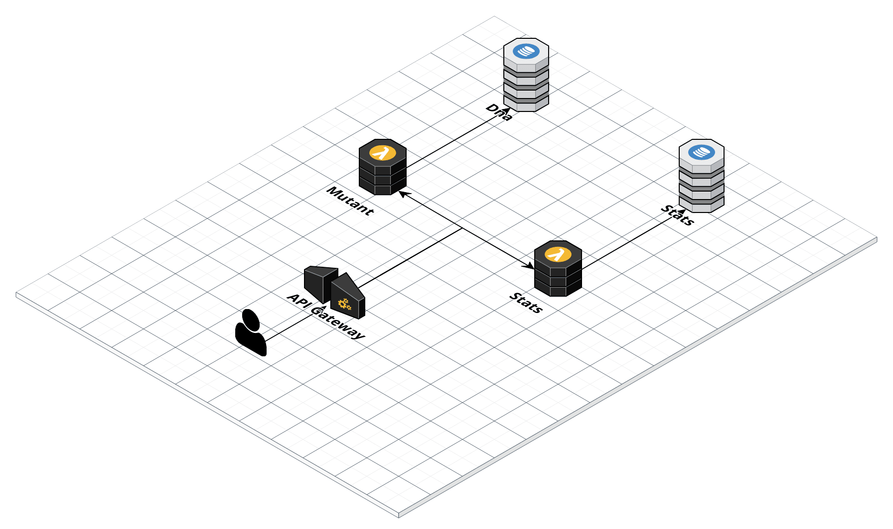
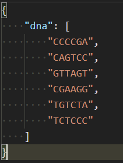
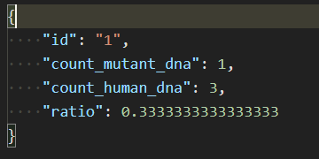
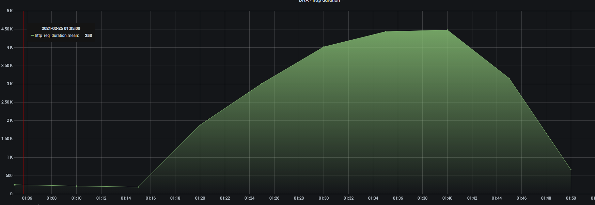
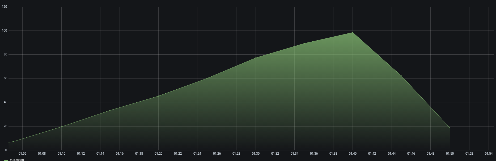
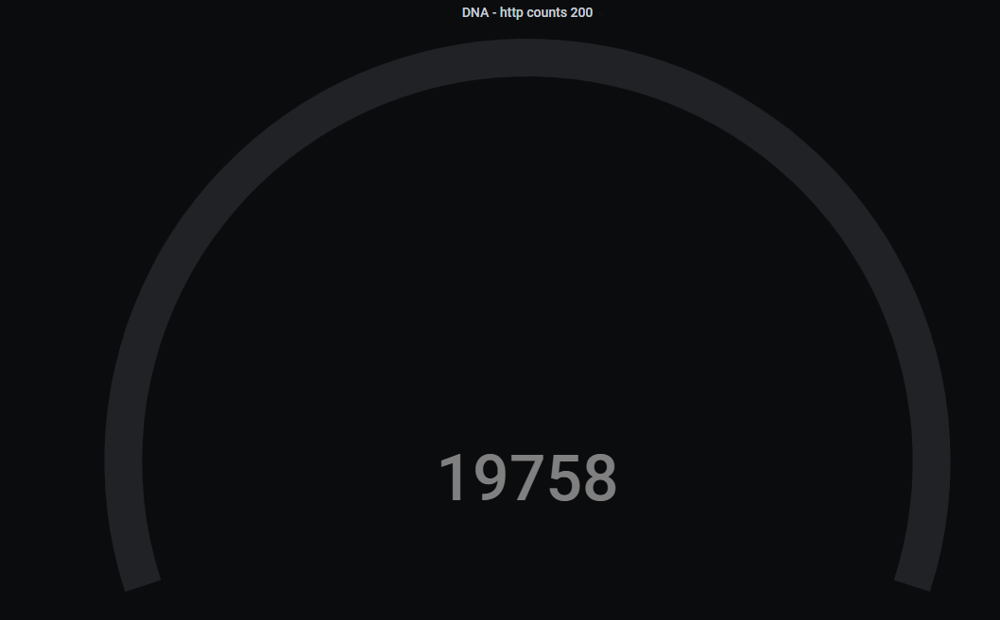
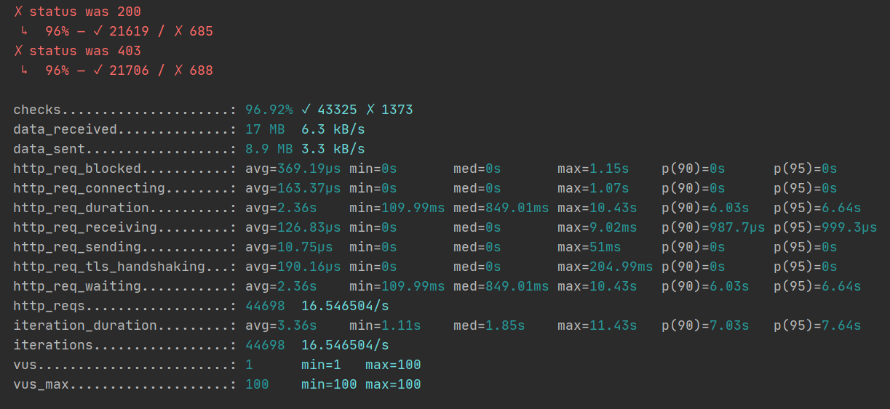

  
   [](https://www.terraform.io)    
   [](https://www.terraform.io)  
      [](https://www.terraform.io)  
  
  **Autor** Juan Jose Orjuela Castillo
     
# Meli-xmen-detector        
 Esta aplicacion te ayudara a determinar si tu ADN es mutante o no.        
        
# Tabla de contenido        
- [Prerequisitos](#Prerequisitos)        
 - [Instalacion](#Instalacion)        
 - [Arquitectura](#Arquitectura)        
 - [Servicios](#Servicios)        
   - [Adn](#Adn)        
   - [Stats](#Stats)        
 - [Pruebas Unitarias](#Pruebas_Unitarias)        
 - [Pruebas Performance](#Pruebas_Performance)        
        
        
# Prerequisitos        
 Vas a necesitar tener instaladas las siguientes herramientas en tu computador:        
        
* [Git](http://git-scm.com/)          
* [Golang  15.x](https://golang.org/dl/)        
* [Terraform 12.x](https://www.terraform.io/downloads.html)        
* [K6](https://k6.io/docs/getting-started/installation)        
* [Paquete aws-lambda-go](https://github.com/aws/aws-lambda-go) (Windows)        
        
# Instalacion ### Generacion binarios mutant y stats: 1. Entrar carpeta ms/ 2. Ejecutar archivo `build.sh` ```  sh build.sh ``` ### Generar Infraestructura: 1. Entrar carpeta terraform/ 2. Crear variables de entorno de tu cuenta AWS:        
    ```  sh         
    export AWS_ACCESS_KEY_ID="xxxxxxx"        
 export AWS_SECRET_ACCESS_KEY="xxxxxxx" export AWS_SESSION_TOKEN="xxxxxxx" ```3. Ejecutar: ``` terraform init ``` 4. Ejecutar: ``` terraform plan ``` 5. Verificar  el inventario de recursos a crear dentro de tu cuenta aws        
6. Ejecutar: ``` terraform apply ``` y al finalizar confirmar con ```yes```        
 ### Encontrar endpoint API :        
 Luego de ejecutar el apply de terraform encontraras la siguinte variable de salida:        
``` poc_endpoint_api_gateway = https://xxxxxxxx/dev ``` Este sera el endpoint en el cual podras  ejecutar los servicios para mas informacion en la documentacion de los servicios ver la seccion servicios        
        
# Arquitectura        
 El despliegue de la aplicacion se realiza en Amazon Web Services y tiene la siguiente arquitectura:        
        
        
# Servicios        
       
 En esta seccion se describen los parametros para consumir los servicios expuestos:      
       
## Adn        
 Este servicio determina si la cadena de ADN enviada es mutante o no.      
**Funcionamiento interno:** 1. El servicio toma la cadena y genera un base 64 de la misma este correspondera al ID unico con el cual sera guardado el registro en la tabla dynamo llamada ```poc_dna_table``` 2. con este ID generado verifica si el registro existe, si es asi valida si es mutante o no el registro y devuelve el codigo correspondiente:      
 * 200 : Mutante      
 * 403: No es Mutante      
3. Si el registro no existe se hara el proceso de verificacion y se guardaran los resultados en la tabla      
4. Por ultimo este resultado sera contabilizado en el registro almacenado en la tabla ```poc_stats_table``` y se actualizara el registro.      
      
**Documentacion tecnica endpoint:**      
 |                || |----------------|-------------------------------------------------| |Endpoint                    | /mutant                             | |Method                      | POST                                | |Example Body                |   | |Status Code (es mutante)    |200                                  | |Status Code ( no es mutante)|403                                  |      
 **Restricciones**      
 - el atributo ```dna ``` debe ser un arreglo de strings y este debe conformar una matriz de NxM elementos siendo N cada elemento del arreglo y cada uno de los M cada letra dentro te cada elemento      
 - Solo se permiten los siguientes caracteres: **(A,T,C,G)**      
 ## Stats        
 Este servicio trae las estadisticas generales de los adns analizados.      
      
**Documentacion tecnica endpoint:**      
      
 |                || |----------------|-------------------------------------------------| |Endpoint                    |/stats| |Method                      |GET| |Status Code (es mutante)    |200                                  | |Ejemplo respuesta||      
 >  Puede consultar los ejemplos en la coleccion de postman en la carpeta postman # Pruebas Unitarias        
 Cobertura en pruebas unitarias : **67.7%**      
       
       
 ## [Reporte de cobertura](./coverage/report.html)      
  # Pruebas de Performance      
 Para las pruebas de Performance se utilizo la herramienta [K6](https://k6.io/docs/)        
      
## Ejecucion:      
 ### DNA Service:      
1. entrar carpeta load-test:      
2. Ejecutar comando:      
```      
 (Ejecutar prueba de humo) k6 run -e TYPE_TEST=smoke_test --summary-export results/dna/summary-smoke-test.json src/services/dna/index.js (Ejecutar prueba de carga) k6 run -e TYPE_TEST=load_test --summary-export results/dna/summary-smoke-test.json src/services/dna/index.js (Ejecutar prueba de estres) k6 run -e TYPE_TEST=stress_test --summary-export results/dna/summary-smoke-test.json src/services/dna/index.js      
 flags adicionales:      
 si usas influxdb para almacenar resultados y mostrarlos por grafana. --out influxdb=http://localhost:8086/k6      
 ```      
 ## Resultados DNA prueba de carga (grafana): ### Duracion de peticiones:       
 ### Usuarios concurrentes en el tiempo:       
 ### Conteo de peticiones cuando son mutantes:      
 ### Conteo de peticiones cuando no son mutantes:       
 ### Metricas generales prueba:     
 ## Resultados DNA prueba de estres (grafana): ### Duracion de peticiones:       
 ### Usuarios concurrentes en el tiempo:       
 ### Conteo de peticiones cuando son mutantes:      
 ### Conteo de peticiones cuando no son mutantes:      
 ### Metricas generales prueba: 